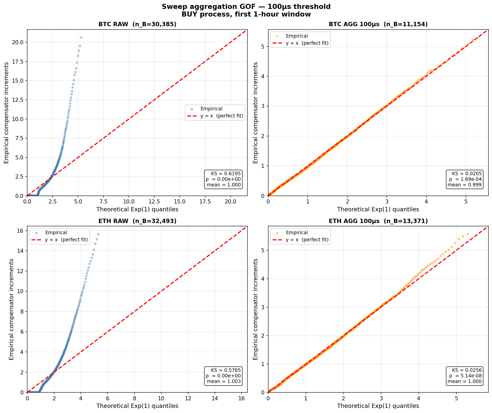
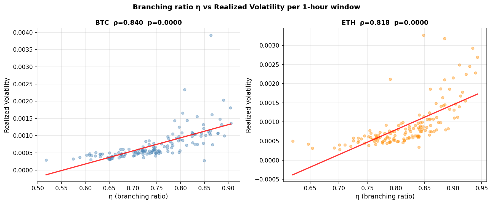
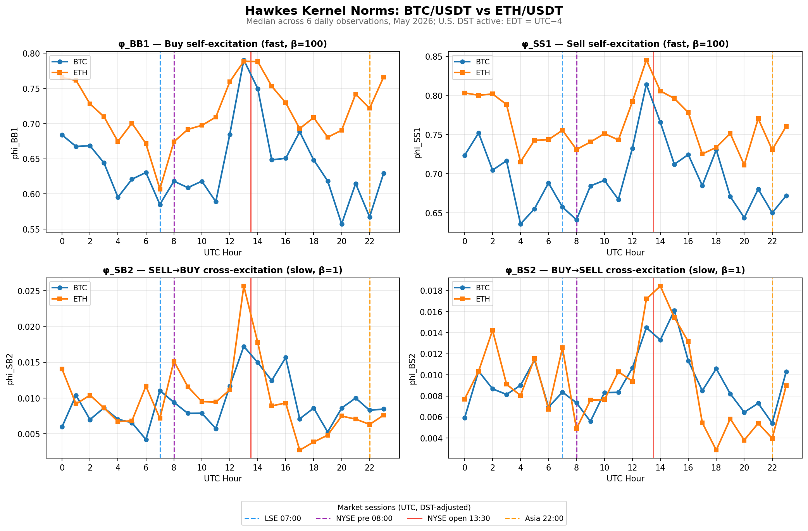
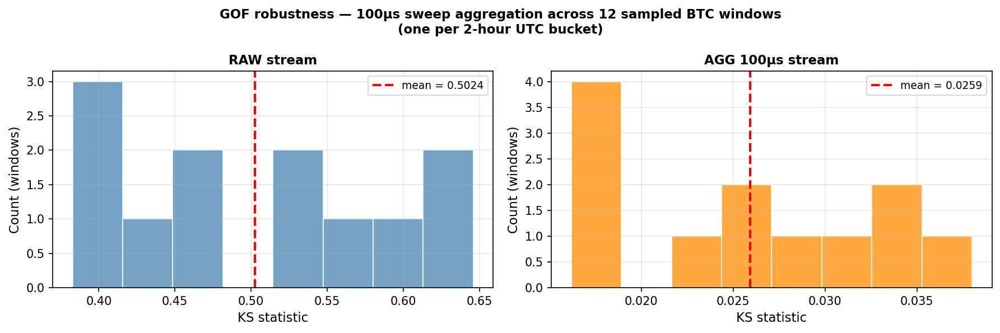

# Hawkes Process Calibration of Cryptocurrency LOB Data

Bivariate Sum-of-Exponentials Hawkes calibration on Binance BTC/USDT and ETH/USDT market-order arrivals, with rolling hourly recalibration over a one-week May 2026 dataset. The repository contains the C++ WebSocket collector, the calibration notebook, and the full set of figures and tables from rolling calibration and time-rescaling goodness-of-fit (GOF) diagnostics.

[](https://www.python.org/)
[](LICENSE)

## Motivation

Recent Hawkes-based limit-order-book studies, including the work of Anantha and Jain (2025) on NSE NIFTY futures, demonstrate strong intraday structure in session-based markets. This project explores whether similar Sum-of-Exponentials Hawkes dynamics persist in 24/7 cryptocurrency market-order data, and whether exchange-level trade fragmentation affects time-rescaling goodness-of-fit when originating order IDs are unavailable.


## Main Contributions

- Extends bivariate SoE Hawkes calibration from NSE NIFTY futures to 24/7 Binance BTC/USDT and ETH/USDT market-order streams (~144 rolling one-hour windows, May 2026).
- Identifies statistically significant UTC-clock self-excitation patterns despite the absence of formal session structure: a Mann–Whitney test rejects time-homogeneity around the NYSE regular open (UTC 13:30) for both assets ($p < 0.005$), while UTC-hour fixed effects explain 35–39% of cross-window variance in excitation strength ($R^2 = 0.352$, bootstrap $p = 0.001$).
- Shows that the Hawkes branching ratio $\eta$ closely tracks hourly realized volatility (Spearman $\rho = 0.84$), linking self-excitation intensity to observable market activity.
- Demonstrates that time-rescaling Kolmogorov–Smirnov goodness-of-fit fails on raw `aggTrade` streams ($KS \approx 0.50$–$0.62$) because unresolved sweep-fill microstructure occurs at sub-100µs timescales relative to the 10ms excitation kernel.
- Introduces a 100µs same-direction time-gap aggregation heuristic, approximating the filtration framework of Anantha Jain, Sobin Joseph, and Maiti (2025), which reduces KS statistics by 91–97% and suggests that filtration choice materially affects Hawkes calibration quality in cryptocurrency LOB data.



## Key Results

### 1 · Sweep aggregation fixes the GOF, consistently across all UTC hours

A single aggressive market order on Binance sweeps multiple price levels, generating several `aggTrade` rows within ~100µs. The 10ms Hawkes kernel cannot resolve these as distinct events, causing the Kolmogorov-Smirnov (KS) test to fail on raw data ($KS \approx 0.50$ to $0.62$). Collapsing sub-100µs same-direction bursts into single events reduces the KS statistic by **91 to 97%** across 12 windows sampled from all UTC hours.


|                                 | Raw stream     | Aggregated (100µs) |
| ------------------------------- | -------------- | ------------------ |
| BTC first window                | KS = 0.620     | KS = 0.020         |
| Mean across 12 sampled windows  | KS = 0.502     | KS = 0.026         |
| Range across 12 sampled windows | [0.383, 0.646] | [0.016, 0.038]     |


Approximately 62% of raw `aggTrade` BUY events in the first window are sub-100µs sweep fills from the same originating market order, not distinct aggressive orders.

### 2 · Branching ratio $\eta$ predicts realized volatility within the hour




| Asset    | $\rho(\eta, RV)$ | p-value | n windows |
| -------- | ---------------- | ------- | --------- |
| BTC/USDT | 0.840            | <0.0001 | 144       |
| ETH/USDT | 0.818            | <0.0001 | 145       |


UTC hour alone explains **35 to 39%** of cross-window variance in $\eta$ (OLS F-test, $p < 0.001$), meaning a model that assumes time-homogeneous order flow misses roughly a third of the within-day structure.

### 3 · Market order self-excitation varies with the UTC clock

Despite operating 24/7 with no formal session boundary, crypto market microstructure is not time-homogeneous. Self-excitation peaks at UTC 13:30 (NYSE regular open, 9:30 AM EDT) for both assets.



> Magnitudes are from raw `aggTrade` streams and are inflated by sweep-fill fragmentation; the qualitative UTC-13:30 pattern is robust to aggregation.

**Targeted Mann-Whitney test, UTC hour 13 vs all other hours:**


| Parameter                                    | BTC $\Delta$% | ETH $\Delta$% | MW p-value (BTC / ETH) |
| -------------------------------------------- | ------------- | ------------- | ---------------------- |
| $\eta$ (branching ratio)                     | +12.4%        | +9.5%         | 0.004 / 0.001          |
| $\varphi_{BB,1}$ (fast BUY self-excitation)  | +18.9%        | +9.5%         | 0.002 / 0.004          |
| $\varphi_{SS,1}$ (fast SELL self-excitation) | +12.6%        | +7.0%         | 0.006 / 0.020          |
| $\varphi_{SB,2}$ (slow SELL→BUY cross)       | +60.3%        | +115.5%       | 0.042 / 0.001          |


OLS regression ($\eta$ on 23 UTC-hour dummies plus asset dummy): $R^2 = 0.352$, $F = 2.56$, p(bootstrap) = 0.001.

ETH shows a sharper UTC-13:30 spike in slow SELL→BUY cross-excitation than BTC, roughly double its rest-of-day baseline, with no BTC counterpart.

## Model

Bivariate Sum-of-Exponentials Hawkes process with $U = 2$ kernel components and fixed decay rates $\beta_1 = 100\text{s}^{-1}$ (10ms) and $\beta_2 = 1\text{s}^{-1}$ (1s). The BUY intensity at time $t$ is:

$$\lambda_B(t) = \mu_B + \sum_{u=1}^{2} \alpha_{BB}^u \sum_{t_j^B < t} e^{-\beta_u(t-t_j^B)} + \sum_{u=1}^{2} \alpha_{SB}^u \sum_{t_k^S < t} e^{-\beta_u(t-t_k^S)}$$

The SELL intensity $\lambda_S(t)$ is symmetric with parameters $\mu_S$, $\alpha_{SS}$, $\alpha_{BS}$. The two-timescale split captures fast momentum (sub-100ms) and slow momentum (sub-second) simultaneously.

10 free parameters per window: $[\mu_B, \mu_S, \alpha_{BB,1}, \alpha_{SS,1}, \alpha_{BS,1}, \alpha_{SB,1}, \alpha_{BB,2}, \alpha_{SS,2}, \alpha_{BS,2}, \alpha_{SB,2}]$. MLE via L-BFGS-B with log-space reparameterisation and 3 random initialisations per window. Log-likelihood inner loop compiled with Numba JIT: ~2.5s per window vs ~60s pure Python.

## Synthetic Recovery Validation

Synthetic parameter recovery from simulated data (Ogata thinning):


| Parameter        | True  | Recovered | Error |
| ---------------- | ----- | --------- | ----- |
| $\varphi_{BB,1}$ | 0.700 | 0.694     | 0.9%  |
| $\varphi_{SS,1}$ | 0.800 | 0.805     | 0.6%  |
| $\varphi_{BB,2}$ | 0.040 | 0.043     | 7.5%  |
| $\varphi_{SB,2}$ | 0.025 | 0.027     | 8.0%  |
| $\eta$           | ~0.89 | 0.853     | 4.2%  |


See `calibration.ipynb` Cell 5 for the full synthetic recovery test.

## Filtration and Goodness-of-Fit

The time-rescaling test (Ogata 1988) checks whether compensator increments $\Lambda_B(t_{i-1}, t_i)$ are i.i.d. $\text{Exp}(1)$. Raw `aggTrade` streams contain sweep fills: a single aggressive order sweeping N price levels generates N rows within ~100µs. The 10ms kernel cannot resolve these, producing heavy-tailed GOF failure ($KS \approx 0.5$ to $0.6$) across all hours.

Collapsing sub-100µs same-direction events into single events (a heuristic approximation of the order-book filtration approach in [Anantha, Jain and Maiti 2025](https://arxiv.org/abs/2507.22712)) drops KS to 0.016 to 0.038 across all sampled windows.



## Reproducibility

### Dependencies

```bash
conda create -n hawkes python=3.11
conda activate hawkes
python -m ipykernel install --user --name hawkes --display-name "Python (hawkes)"
pip install -r requirements.txt
```

### Data collection

The collector streams Binance `aggTrade` and `bookTicker` combined feeds per symbol. Built with CMake on a GCP VM (asia-northeast1), using IXWebSocket for TLS WebSocket handling and nlohmann/json for message parsing.

```bash
# On GCP VM: install system dependencies and build
sudo apt install -y libeigen3-dev libssl-dev
cd ~/collector
mkdir -p build && cd build
cmake .. && make -j1          # -j1 to stay within 1 GB RAM; swap required
```

```bash
# Run in a persistent tmux session (auto-started on reboot via crontab @reboot)
tmux new-session -s lob
cd ~/collector/build
./collector --outdir ~/lob_data/
# Ctrl-B D to detach
```

The collector writes one row per event to `~/lob_data/<symbol>_events.csv`: `timestamp_us, event_type, price, quantity, symbol`. Timestamps are in microseconds; monotone ordering is enforced at write time. Event types: 0 = BUY market order, 1 = SELL market order, 2 = OFI positive, 3 = OFI negative. OFI events (~93% of rows) come from `bookTicker`; market orders from `aggTrade`.

Data collected from May 10 (20:32 UTC) to May 16 (20:27 UTC), 2026 (143.9 usable hours). An 8.7-hour connectivity gap (May 16 20:27 to May 17 05:09 UTC) is excluded automatically by the rolling-window calibration.

### Preprocessing

Filter from raw events (60M rows, ~3 GB) to market orders only (~4.3M BTC, ~3.5M ETH):

```bash
cd ~/collector/hawkes
python3 preprocess.py
```

Reads `~/lob_data/btcusdt_events.csv` and `ethusdt_events.csv`, streams line-by-line without loading into memory, writes to `~/collector/hawkes/data/btcusdt_mo.csv` and `ethusdt_mo.csv` with the same schema. Prints row counts and BUY:SELL ratio on completion.

### Calibration

Open `calibration.ipynb` and run cells in order:


| Cell   | Purpose                                                                               |
| ------ | ------------------------------------------------------------------------------------- |
| 0 to 2 | Imports, data load, buy/sell split                                                    |
| 3      | First-hour window extraction                                                          |
| 4      | `soe_loglik_fast` (Numba JIT) + `fit_window_soe_fast`                                 |
| 5      | Ogata simulation + synthetic recovery test                                            |
| 6      | Unit tests                                                                            |
| 7      | `aggregate_sweeps`, `compute_compensator_increments`, `time_rescaling_test_corrected` |
| 8      | KS vs sweep threshold, selects optimal 100µs aggregation gap                          |
| 9      | Sweep comparison + baseline GOF (2×2 grid)                                            |
| 10     | Rolling calibration (run once, ~12 min; saves CSVs)                                   |
| 11, 12 | Exploratory parameter time-series plots (optional)                                    |
| 13     | KW + Mann-Whitney UTC seasonality tests                                               |
| 14     | OLS regression + bootstrap F-test                                                     |
| 15     | $\eta$ vs realized volatility                                                         |
| 16     | `plot_kernel_norms_by_hour`                                                           |


Numba warmup ~30s on first call. Per-window fit ~2.5s. Full rolling calibration ~12 minutes for 289 windows.

## Repository Structure

```
hawkes-lob/
├── collector/                  # C++ WebSocket client
│   ├── CMakeLists.txt
│   └── main.cpp
├── hawkes/
|   ├── data/                       # Not tracked in git due to size; regenerate via preprocess.py
|   │   ├── btcusdt_mo.csv          # preprocessed market orders (4.3M rows)
|   │   └── ethusdt_mo.csv          # preprocessed market orders (3.5M rows)
|   ├── results/
|   │   ├── results_btcusdt.csv     # 144 windows × 12 parameters
|   │   ├── results_ethusdt.csv     # 145 windows × 12 parameters
|   │   ├── kernel_norms_by_hour.png
|   │   ├── gof_baseline.png
|   │   ├── gof_sweep_comparison.png
|   │   ├── gof_robustness.png
|   │   ├── ks_vs_threshold.png
|   │   └── eta_vs_rv.png
|   ├── calibration.ipynb
|   ├── preprocess.py
|   ├── requirements.txt
├── CITATION.cff
├── README.md
└── LICENSE
```

Preprocessed CSVs (`data/*_mo.csv`) are excluded from git tracking due to size. Regenerate them by running `preprocess.py` against the raw collector output, or contact the author for direct access.

## Future Work

- **Apply the order-level filtration of Anantha, Jain and Maiti (2025).** The 100µs sweep-gap heuristic is a time-gap proxy for their principled order-ID-based filtration; implementing the original method on a dataset that exposes lifecycle IDs would quantify how much information the proxy preserves.
- **Forecasting linkage to Anantha and Jain (2025).** Test whether the UTC-hour seasonality in the kernel norms $\varphi$ predicts short-term order flow imbalance, which is the original forecasting question of the source paper.
- **Third exponential component at $\beta_3 \approx 10000\text{s}^{-1}$ (~100µs scale)** to capture sweep-fill substructure within the model itself, rather than discarding it via aggregation.
- **Adaptive decay-rate selection.** Replace fixed $\beta_1 = 100$, $\beta_2 = 1$ with profile-likelihood or cross-validation-based selection per window.
- **Re-run rolling calibration on sweep-aggregated streams** to confirm the UTC-13:30 seasonality persists after aggregation; current rolling figures use raw streams.
- **More assets and longer windows.** Extend to SOL, XRP and multi-week coverage to test whether the UTC-hour pattern is universal and stable beyond six daily cycles.

## References

- Anantha, A. N. and Jain, S. (2025). *Forecasting high frequency order flow imbalance using Hawkes processes.* Computational Economics. [arXiv:2408.03594](https://arxiv.org/abs/2408.03594)
- Anantha, A. N., Jain, S. and Maiti, P. (2025). *Order Book Filtration and Directional Signal Extraction at High Frequency.* [arXiv:2507.22712](https://arxiv.org/abs/2507.22712)
- Joseph, S. S. and Jain, S. (2024). Non-parametric Hawkes on cryptocurrency LOB. [arXiv:2402.04740](https://arxiv.org/abs/2402.04740)
- Ogata, Y. (1988). Statistical models for earthquake occurrences. *JASA* 83(401).
- Bacry, E., Jaisson, T. and Muzy, J.-F. (2016). *Quantitative Finance* 16(8).
- Hardiman, S. J., Bercot, N. and Bouchaud, J.-P. (2013). *European Physical Journal B* 86(10).
- Filimonov, V. and Sornette, D. (2012). [arXiv:1204.2406](https://arxiv.org/abs/1204.2406)
- Almgren, R. and Chriss, N. (2001). *Journal of Risk* 3(2).
- Cartea, Á., Jaimungal, S. and Penalva, J. (2015). *Algorithmic and High-Frequency Trading.* Cambridge.

## Citation

```bibtex
@misc{hawkes-lob-2026,
  author = {Mummalaneni, Jashwanth},
  title  = {Hawkes Process Calibration of Cryptocurrency Limit Order Book Data},
  year   = {2026},
  url    = {https://github.com/Jashwanth537/hawkes-lob}
}
```

## License

MIT. See [LICENSE](LICENSE).